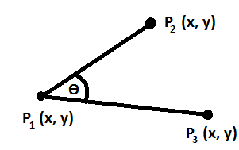

# calculate_angle_from_3_points
A simple example to calculate degree angle from 3 given cartesian points in Python



According to the above figure, the points are plotted in the result figure are organized as *Red, Green, and Blue* for *P1, P2, and P3* respectively.

The purposed function:
```python3
def calculate_angle(p1x, p1y, p2x, p2y, p3x, p3y):
    a = math.dist([p2x,p2y], [p3x,p3y])
    b = math.dist([p1x,p1y], [p2x,p2y])
    c = math.dist([p1x,p1y], [p3x,p3y])
    cos_C = ((a*a) + (b*b) - (c*c)) / (2*a*b)
    C_degree = math.acos(cos_C) * (180.0 / math.pi)
    return C_degree
```


